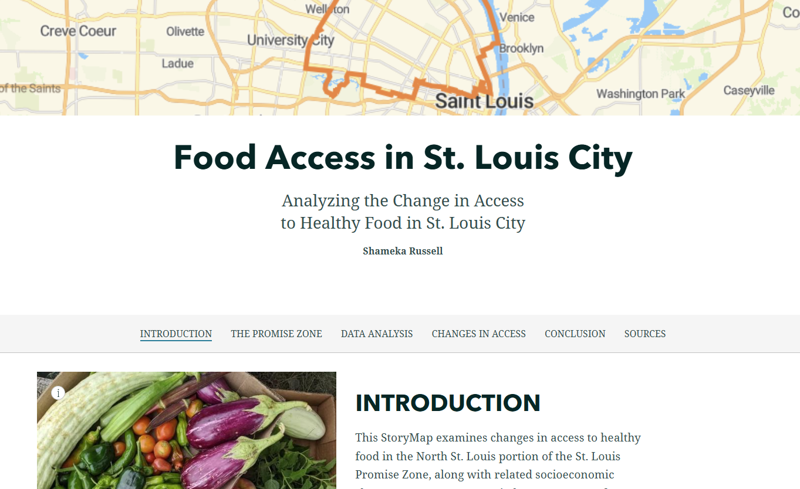

# Shameka Russell

Welcome to my GitHub portfolio. Here you can find information about my background, experience, and project. My name is Shameka Russell, and I am a Senior Finance and Planning Analyst in Emergency Medicine at Washington University in St. Louis. I have a bachelor’s in Elementary Education from the University of Missouri-St. Louis. After spending a few years in the education field, I pivoted to finance and administration. I bring more than eight years of experience in budgeting, financial reporting, and process improvement across higher education. In my current role, I work extensively with Workday, Adaptive Planning, and Excel to develop and monitor budgets, analyze expenses, and provide guidance with clear, data-driven insights.
I am also completing a Certificate in Data Analytics at Washington University, where I am building deeper skills in SQL, Tableau, and data visualization. My earlier background as a certified elementary and ESOL teacher has given me a strong foundation in communication and stakeholder engagement, which I now apply to translating complex financial and data concepts for non-technical audiences.

---

## Navigation

- [Home](#shameka-russell)
- [CV](#curriculum-vitae)
- [Project](#project)
- [Contact](#contact)
  

---

## Curriculum Vitae

You can view or download my CV here:

- [View my CV (PDF)](Shameka_Russell_CV.pdf)

---

## Project

### Food Access in North St. Louis City
This project examines how access to healthy food has changed in eight North St. Louis City zip codes within the federally designated St. Louis Promise Zone (2015–2025), an area characterized by high poverty and longstanding disinvestment. Using data from PolicyMap, the U.S. Census Bureau, USDA Economic Research Service, Think Health St. Louis, the St. Louis Metro ArcGIS Portal, and prior work by the Missouri Coalition for the Environment, the analysis compares two periods: roughly 2010–2014 (baseline) and 2020–2024 (current).

The study finds meaningful economic improvement over time. Average poverty rates across the eight zip codes decreased by about 17 percentage points, and per capita income increased by approximately 74%, with some zip codes (e.g., 63106 and 63108) seeing especially strong growth. However, despite these gains, the area’s poverty rates remain above national averages, and incomes continue to lag behind broader U.S. trends.

Transportation and food access remain critical challenges. A significant share of households still lack access to a car, increasing dependence on public transit, walking, and biking to reach full-service grocery stores. Mapping of SNAP-accepting retailers shows that convenience stores dominate the local food landscape, while supermarkets and larger grocery options are relatively scarce. The project integrates bus routes and emerging bicycle and pedestrian infrastructure (developed in partnership with Trailnet) to highlight where “safe pathways” to healthy food exist—and where gaps remain.

Overall, the project provides a data-driven picture of progress and persistent inequities in North St. Louis City, emphasizing that improvements in income and poverty do not automatically translate into equitable, practical access to healthy food.

---

## Contact

- Email: mrssrussell2015@gmail.com 
- GitHub: [ShamekaRussell](https://github.com/srussell2026.github.io)
